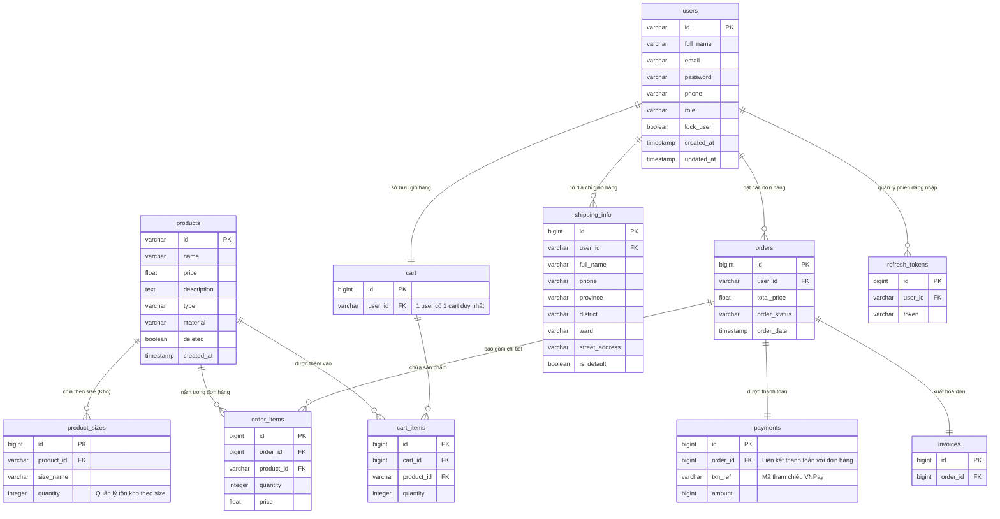

# Entity Relationship Diagram (ERD)

Sơ đồ ERD thể hiện các thực thể (bảng) trong cơ sở dữ liệu và mối quan hệ giữa chúng.
Hệ thống sử dụng cơ sở dữ liệu **PostgreSQL** (hoặc tương đương ở môi trường SQL Server/MySQL). Các khóa chính (PK) và khóa ngoại (FK) được chú thích rõ ràng.

### Mô tả chi tiết Khóa Ngoại (Foreign Keys)
- `shipping_info.user_id` -> Tham chiếu tới bảng `users.id` (1 User có nhiều địa chỉ).
- `cart.user_id` -> Tham chiếu tới bảng `users.id` (Mỗi User sở hữu 1 giỏ hàng duy nhất).
- `cart_items.cart_id` -> Tham chiếu tới bảng `cart.id`.
- `cart_items.product_id` -> Tham chiếu tới bảng `products.id`.
- `orders.user_id` -> Tham chiếu tới bảng `users.id`.
- `order_items.order_id` -> Tham chiếu tới bảng `orders.id`.
- `order_items.product_id` -> Tham chiếu tới bảng `products.id`.
- `product_sizes.product_id` -> Tham chiếu tới bảng `products.id` (Quản lý số lượng tồn kho theo thuộc tính kích cỡ).
- `payments.order_id` -> Tham chiếu tới bảng `orders.id` (Thanh toán qua VNPay).
- `invoices.order_id` -> Tham chiếu tới bảng `orders.id`.
- `refresh_tokens.user_id` -> Tham chiếu tới bảng `users.id`.
