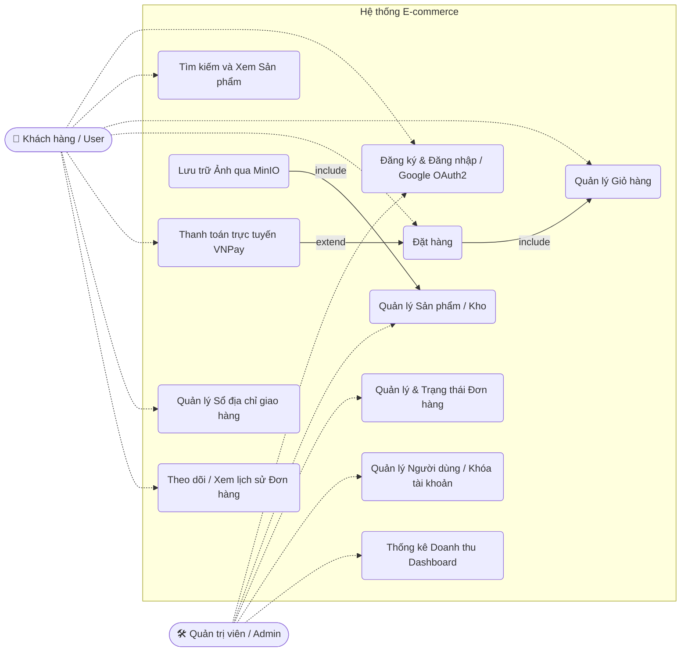

# Use Case Diagram

Sơ đồ Use Case thể hiện các hành động (chức năng) mà người dùng (`User`) và quản trị viên (`Admin`) có thể thực hiện trên hệ thống E-commerce.

### Chi tiết các luồng Use Case chính:

1. **Khách hàng (User):**
   - **Đăng nhập:** Có thể định danh qua Email/Pass truyền thống hoặc Login with Google (OAuth2).
   - **Xem và Tìm kiếm:** Truy xuất danh sách sản phẩm, bộ lọc, xem chi tiết (size, mô tả).
   - **Giỏ hàng:** Thêm, sửa, xóa sản phẩm trong Giỏ hàng cá nhân (`Cart`).
   - **Đặt hàng và Thanh toán:** Tạo đơn hàng dựa vào dữ liệu trong giỏ hàng. Cung cấp API tích hợp cổng thanh toán trực tuyến **VNPay** để thực hiện thanh toán.
   - **Cá nhân hóa:** Quản lý danh sách địa chỉ nhận hàng lưu sẵn để check-out nhanh chóng (`Shipping Info`).

2. **Quản trị viên (Admin):**
   - **Quản lý sản phẩm:** Thêm mới, sửa xóa thông tin, quản lý số lượng tồn kho theo Size. Tích hợp trực tiếp **MinIO** để lưu trữ hình ảnh sản phẩm độc lập.
   - **Quản lý Đơn hàng:** Kiểm tra danh sách đơn, xuất hóa đơn, cập nhật trạng thái đơn (Đang xử lý, Đang giao, Đã hoàn thành...).
   - **Quản lý Khách hàng:** Xem hồ sơ user, thống kê mua hàng và có quyền khóa (`lock user`) tài khoản.
   - **Dashboard:** Phân tích dữ liệu doanh thu dựa trên các hóa đơn và giao dịch đã hoàn tất.
